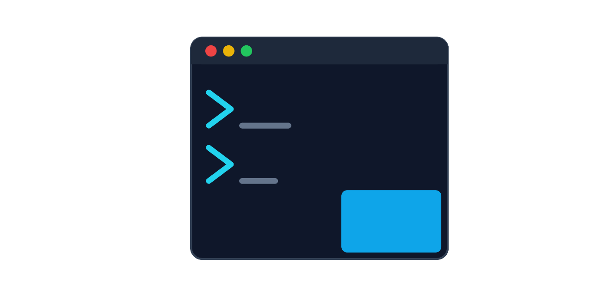

<p align="center">
  
</p>

<h1 align="center">pterm</h1>

<p align="center">A terminal multiplexer organized around projects.</p>

<p align="center">
  <a href="https://github.com/jtwebman/pterm/releases">Download</a> &middot;
  <a href="https://github.com/jtwebman/pterm/issues">Report a Bug</a>
</p>

---

pterm gives every project its own workspace with terminals, environment variables, configurable commands, and git worktree branches — all in one window. Run shells, Claude, Codex, OpenCode, or any CLI tool in real terminal panes without juggling tabs across multiple apps.

## Features

### Project Workspaces

- **Project-based organization** — each project points to a folder and gets its own set of terminals, env vars, and commands
- **Per-project environment variables** — injected into every terminal spawned for that project
- **Configurable commands** — define any CLI tool as a launchable command: shells, Claude, Codex, `npm run dev`, database consoles, anything
- **Default command detection** — auto-detects if `claude`, `codex`, or `opencode` are on your PATH and offers them as launch options
- **Session persistence** — terminals survive app restarts with full scrollback and tab ordering preserved (SQLite-backed)

### Git Integration

- **Git worktree branches** — create isolated worktree copies of your project to work on multiple features in parallel without conflicts
- **Worktree file copying** — configurable glob patterns to copy files (`.env`, `node_modules`, etc.) into new worktrees
- **Live branch detection** — sidebar shows the current git branch for each folder, updates in real time via `.git/HEAD` file watcher (no polling)
- **Branch management dialog** — switch branches on the main folder, create new worktree branches with autocomplete, delete worktrees with cleanup
- **Branch creation from default branch** — new branches are based off `origin/HEAD`, `main`, or `master` automatically
- **Stale worktree pruning** — runs `git worktree prune` before and after operations to keep things clean

### Terminal

- **Real PTY terminals** — full terminal emulation via xterm.js and node-pty, not a wrapper or pseudo-terminal
- **Copy/paste** — Ctrl+C copies when text is selected (otherwise sends SIGINT), Ctrl+V pastes. Cmd+C/V on Mac. Ctrl+Shift+C/V also supported
- **Terminal search** — Ctrl+F opens a search bar with match highlighting, next/previous navigation, and match count
- **Clickable URLs** — links in terminal output open in your default browser
- **Font zoom** — Ctrl+wheel to zoom terminal font size (6-32px range), persisted across restarts
- **Terminal padding** — comfortable 4px padding on top, left, and bottom edges

### Smart Activity Detection

- **Status dots** — green (working/busy), yellow (waiting for input), gray (idle/exited) shown on each terminal tab
- **Activity text** — sub-text in sidebar shows what the terminal is doing ("Running", "Using tools", "Waiting for input", etc.)
- **Shell sessions** — detects child processes via `pgrep` (Unix) or WMI (Windows)
- **Claude sessions** — uses Claude's hooks system for instant activity updates (thinking, using tools, waiting) with process-tree fallback
- **Codex sessions** — tails JSONL session files for granular state detection (task started, function calls, task complete) with notify hook
- **OpenCode sessions** — writes a plugin that reports session status via activity file
- **5-minute staleness timeout** — activity files older than 5 minutes are ignored

### Themes

- **10 built-in terminal themes** — VS Code Dark, VS Code Light, Dracula, Nord, Catppuccin Mocha, Solarized Dark, Solarized Light, Gruvbox Dark, Tokyo Night, Monokai
- **Per-project theme override** — set a different terminal color theme for each project
- **Custom theme editor** — create your own themes with color pickers, hex inputs, and live preview
- **System theme sync** — follows your OS dark/light preference, or force dark/light mode
- **Default theme setting** — set a global default terminal theme in settings

### Sidebar and Organization

- **Collapsible project tree** — expand/collapse projects to see their terminals grouped by branch
- **Drag-and-drop reordering** — reorder projects, worktree branches, and terminals with distinct colored drop indicators (blue/amber/cyan)
- **Group-specific drop zones** — MIME types prevent cross-group drops (can't drop a terminal into the project list)
- **Resizable sidebar** — drag the edge to resize (150-500px), width persisted across restarts
- **Sidebar font zoom** — Ctrl+wheel to zoom sidebar text independently of terminal
- **Persistent ordering** — project, branch, and terminal order all saved across restarts

### Cross-Platform

- **macOS** — zsh or bash, native app menu (About, Hide, Quit, Copy, Paste, Select All)
- **Windows** — cmd, PowerShell, or WSL2 (auto-detects available WSL distros)
- **Linux** — bash or zsh
- **Shell fallback chains** — `$SHELL` → `/bin/zsh` → `/bin/bash` → `/bin/sh` (Unix), `ComSpec` → `powershell.exe` → `cmd.exe` (Windows)
- **Per-command shell override** — each command can specify which shell to use
- **Configurable browser** — choose which browser opens for terminal URLs

### Keyboard Shortcuts

| Shortcut | Action |
|----------|--------|
| Ctrl+T | New terminal |
| Ctrl+Tab | Next terminal |
| Ctrl+Shift+Tab | Previous terminal |
| Ctrl+F | Search terminal |
| Ctrl+wheel | Zoom font size |
| Ctrl+Shift+I | Toggle DevTools (dev mode only) |

## Install

Download the latest release for your platform from [GitHub Releases](https://github.com/jtwebman/pterm/releases).

| Platform | Format |
|----------|--------|
| macOS (Apple Silicon) | `.dmg` (arm64) |
| macOS (Intel) | `.dmg` (x64) |
| Windows | `.exe` (NSIS installer) |
| Linux | `.deb`, `.rpm`, `.pacman`, `.AppImage` |

> **Note:** The app is not code-signed yet. On macOS, you'll need to right-click → Open on first launch (or go to System Settings → Privacy & Security → Open Anyway). On Windows, click "More info" → "Run anyway" on the SmartScreen prompt. Linux installs work without any extra steps.

## Build from Source

Requires Node.js 24+.

```bash
git clone https://github.com/jtwebman/pterm.git
cd pterm
npm install
npm run dev
```

### Scripts

| Command | What it does |
|---------|-------------|
| `npm run dev` | Start dev server with hot reload |
| `npm run build` | Build main, preload, and renderer |
| `npm run check` | Format, lint, and typecheck (Vite+ with Oxlint/Oxfmt) |
| `npm run test` | Build and run all tests (unit + e2e) |
| `npm run dist` | Build and package for current platform |

## Tech Stack

- **Electron 41** + **Node 24** — native TypeScript via `--experimental-strip-types`
- **React 19** + **Vite 8** — renderer with TailwindCSS v4
- **xterm.js 6** + **node-pty 1.1** — real PTY terminals
- **Vite+** — Oxlint (linting) + Oxfmt (formatting) + TypeScript type checking
- **Playwright** (e2e tests) + **Vitest** (unit tests)
- **Electron IPC** — no WebSocket server, no separate backend process
- **React context + useReducer** — state management with no external libraries
- **SQLite** — session persistence and scrollback storage

## Contributing

Issues are welcome! If you find a bug or have a feature request, please [open an issue](https://github.com/jtwebman/pterm/issues).

**Pull requests are not open at this time.** With the current wave of AI-generated PRs flooding open source, reviewing them takes more time than just fixing the issues directly. I'm actively maintaining pterm and will address all reported issues.

If you want to get involved or collaborate, reach out to me as **@jtwebman** on any social platform.

## License

[MIT](LICENSE)
